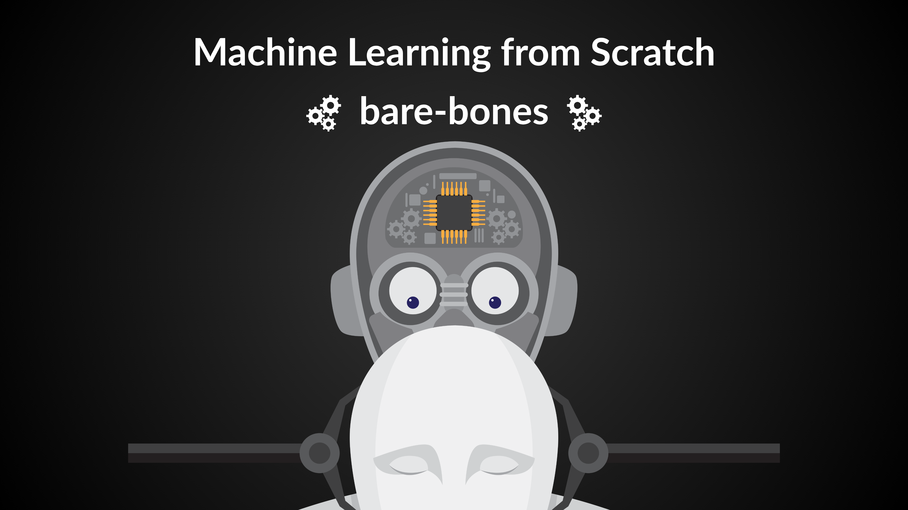

# bare-bones-ml



<div align="center">

[](https://github.com/your-username/BareBonesML)
[](LICENSE)

[](https://pytorch.org/)

</div>

## Welcome to bare-bones-ml!

This repository is a collection of my implementations of various Machine Learning algorithms. It is a continuously evolving project, with more depth being added as well as new models being implemented as I understand them better.

> “What I cannot create, I do not understand.” — Richard Feynman

The project is in two parts:

1.  **Part 1: From Scratch (with NumPy)**
    Implementing foundational deep learning architectures using only NumPy. This approach forces a deep dive into the underlying mathematics of backpropagation, optimizers, and layer mechanics.

2.  **Part 2: PyTorch Implementations**
    The goal here is to leverage a high-level framework to efficiently build and experiment with modern, complex architectures.

## Project Roadmap & What's Inside?

This repository contains both the library code for each model and the corresponding notebooks.

### Part 1: From Scratch
This phase covers the creation of a complete deep learning library from scratch.

**Completed**
- **Autograd Engine:** A `Tensor` object that builds a computational graph and performs backpropagation.
- **Neural Network Layers:** `Linear`, `Embedding`, `LayerNorm`, and `Module` containers.
- **Optimizers:** `SGD` and `Adam`.
- **Recurrent Architectures:**
    -   `RNN` for basic sequence processing.
    -   `LSTM` to solve the vanishing gradient problem.
-  **The Transformer:**
    -   `Attention Mechanism` (Scaled Dot-Product and Multi-Head).
    -   `Positional Encodings`.
    -   Full `Encoder-Decoder` Transformer architecture.

**Upcoming**
- **Convolutional Neural Networks (CNN):** Implementing convolutional layers and pooling operations.

### Part 2: PyTorch Implementations
This focuses on building and explaining modern architectures using PyTorch.

**Completed**
- **Vision Transformer (ViT):** Applying the Transformer architecture to computer vision.

**Upcoming**
- **Autoencoders (AE):** Exploring unsupervised learning, compression, and feature extraction.
- **Variational Autoencoders (VAE):** Evolving AEs into true generative models capable of creating new data.
- **Generative Adversarial Networks (GAN):** Implementing the classic two-player game between a Generator and a Discriminator.

## Getting Started

To explore the code and run the notebooks, follow these steps:

1.  **Clone the repository:**
    ```bash
    git clone https://github.com/your-username/BareBonesML.git
    cd BareBonesML
    ```

2.  **Set up a virtual environment (recommended):**
    ```bash
    python -m venv venv
    source venv/bin/activate  # On Windows, use `venv\Scripts\activate`
    ```

3.  **Install the dependencies:**
    ```bash
    pip install -r requirements.txt
    ```

## Usage and Examples

The code for each model is organized into two main directories:
-   `from_scratch/`: Contains the NumPy-based implementations from Part 1.
-   `pytorch_implementations/`: Contains the PyTorch-based implementations from Part 2.

Each major concept is accompanied by a detailed, runnable Jupyter Notebook in the `notebooks/` directory.

## Contributing

This is a personal learning project, but feedback, suggestions, and corrections are always welcome! Feel free to open an issue or submit a pull request if you find a bug or have an idea for improvement.

## License

This project is licensed under the MIT License. See the [LICENSE](LICENSE) file for details.
